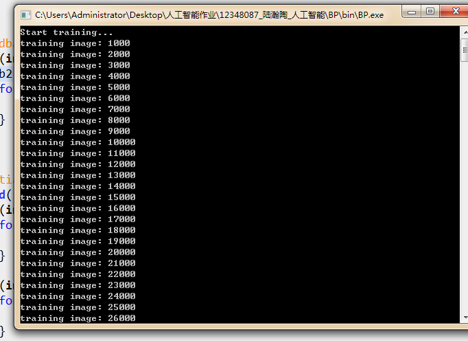
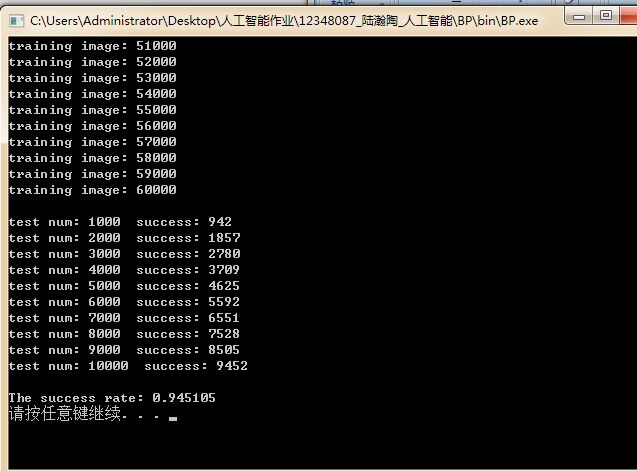
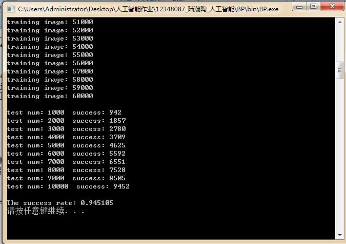

# BP-Hand-Writing
基于C++，使用BP神经网络识别手写字体（使用MNIST数据集）

## 1．导言
我们在现实生活中，会在多个场合，都能运用到字体的识别技术。如道路监控摄像头，拍下过往车辆的图片，需要识别车辆的车牌号；对身份证号码的手写版或者影印版，需要提取录入到数据库，等等。如果采用传统的人工识别方法，不仅效率低下，而且在遇到大量数据的情况下，人工识别的错误率也会直线上升。根据这个问题背景，本次实验的目标，就是通过BP神经网络，识别出手写的数字0~9 。

## 2．实验过程
BP神经网络是一种按误差逆传播算法训练的多层前馈网络，BP网络能学习和存贮大量的输入-输出模式映射关系，而无需事前揭示描述这种映射关系的数学方程。它的学习规则是使用最速下降法，通过反向传播来不断调整网络的权值和阈值，使网络的误差最小。BP神经网络模型拓扑结构包括输入层、隐藏层和输出层。
针对此次实验，我们对每一张手写图片，先把它处理成一个28 * 28 的01矩阵，其中1代表数字的笔画着色部分，0则代表空白。然后我们把该矩阵，扁平成一个784维的输入向量，输入到输入层。经过隐藏层（此次实验隐藏层结点数取100），到达输出层时，是一个10维的输出向量，每一位分别对应数字的0~9 。通过比较输出层的实际输出与期望输出，进行反向反馈调节，并循环重复上述步骤。

##神经网络中的公式如下：(0<= i<784; 0<=j<100; 0<=k<10)
#### 1）激活函数：
    f(x) = 1 / (1 + e^-x) ;
#### 2）隐藏层的输出： 
    output1[j] = f(sigma(input[i] * weight1[i][j]) + b1[j])
#### 3）输出层的输出： 
    output2[k] = f(sigma(output1[j] * weight2[j][k]) + b2[k]);
#### 4）输出层的delta误差： 
    delta2[k] = (output2[k]) * (1.0 - output2[k]) * 	(output2[k] - target[k]);
#### 5）隐藏层的delta误差：
    delta1[j] = (output1[j]) * (1.0 - output1[j]) * sigma(weight2[j][k] * delta2[k]);
#### 6）隐藏层反向调整:
	权值:    weight1[i][j] = weight1[i][j] - alpha * input[i] * delta1[j];
	阀值:    b1[j] = b1[j] - alpha * delta1[j];
#### 7）输出层反向调整:
	权值:    weight2[j][k] = weight2[j][k] - alpha * output1[j] * delta2[k];
	阀值:    b2[k] = b2[k] - alpha * delta2[k];

公式中f(x)为激活函数，weigh为权值，b为阀值，output为输出向量，delta为误差，alpha为神经网络的学习率（此次实验取的值为0.35）

## 3．结果分析
本次实验使用的数据来源，为MNIST手写数字数据集，其中主要有以下4个文件：

1）	train-images.idx3-ubyte：跳过开头16个字节，每784个字节代表一张图片，总共有60000张。其中每一个字节代表28 * 28 中的一个像素点，取值范围为0~256。（本次实验中，像素点值大于128， 输入层的01矩阵对应维取1；小于128，01矩阵对应维取0）。

2）	train-labels.idx1-ubyte： 跳过开头8个字节，每一个字节，为1）中对应图片的期望输出，取值范围0~9，数量也是60000。

3）	t10k-images.idx3-ubyte：与1）相同，不过图片数量为10000张。

4）	t10k-labels.idx1-ubyte： 与2）相同，不过数量为10000，与3）对应。

其中，第1与第2个文件中60000张图片，用于神经网络的训练，如下图：

第3与第4个文件中10000张图片，用于识别正确率的测试，如下图:

==========

#### 经过60000次训练后，在对10000张图片进行测试时，神经网络对手写字体的识别率，可以到达94%左右，如下图:

